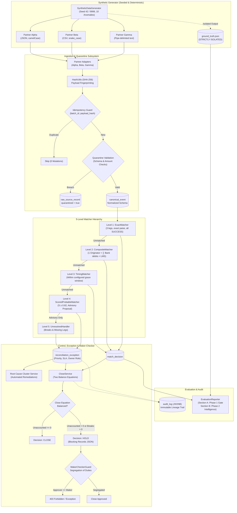

# Co-Lending Control Tower
### Production-Ready Financial Reconciliation & Control Engine
### Vivriti Next Hackathon Challenge (SDE2 Assessment)

---

## 1. Overview & Core Philosophy
The **Co-Lending Control Tower** is an enterprise-grade reconciliation engine engineered to validate, reconcile, and audit tripartite loan disbursements across three decoupled, distributed systems:
1. **Originator Feed**: Loan disbursement instructions submitted by co-lending partner platforms (PARTNER_ALPHA, PARTNER_BETA, PARTNER_GAMMA).
2. **Bank Settlement Core**: Settlement debits and UTR confirmations from core banking platforms.
3. **Loan Management System (LMS)**: Loan booking records and active facility lifecycle logs.

### Core Architectural Invariants:
- **Currency Invariant**: 100% of monetary transactions are stored and calculated strictly as `long` in Indian Paise (no `Double`, `Float`, or floating-point rounding errors).
- **Zero False Matches**: Hard gate for Phase 1. False matches in financial reconciliation lead to unhedged credit risk and direct loss of capital.
- **Zero Silent Write-offs**: Every single rupee must be accounted for. Mismatches are systematically routed to an exception break queue with ownership and SLA tracking.
- **Strict Phase Boundary**: Level 4 Scored Probable Matching is **read-only advisory** ($S \ge 0.82$, requires human authorization). It NEVER auto-reconciles and NEVER mutates the financial close equation.
- **Ground Truth Isolation**: The reconciliation engine is strictly decoupled from the generator's ground truth (enforced via ArchUnit).

---

## 2. Architecture & Pipeline Diagram



---

## 3. Technology Stack & Local Environment

- **Java**: 21 LTS (Eclipse Adoptium)
- **Framework**: Spring Boot 3.3.5
- **Database**: PostgreSQL 16 (Local instance on `localhost:5432` or via Docker Compose)
  - Runtime Database: `controltower` (user: `postgres`, password: `password`)
  - Test Database: `controltower_test` (user: `postgres`, password: `password`)
- **Schema Management**: Flyway 10.10.0 (`db/migration/V1__init_schema.sql`)
- **Architecture Enforcement**: ArchUnit 1.3.0
- **Build Tool**: Apache Maven 3.9.9 (`mvnw.cmd` / `mvnw`)

---

## 4. Quick Start & Execution

### 1. Database Setup
Ensure PostgreSQL is running locally on port 5432, or use the provided `docker-compose.yml`:
```bash
docker compose up -d
```
The databases `controltower` and `controltower_test` will be initialized automatically.

### 2. Run the Full Test Suite
All 7 hard-gate tests run end-to-end against local PostgreSQL:
```cmd
.\mvnw.cmd clean test
```
Or on Linux / macOS:
```bash
./mvnw clean test
```

### 3. Automated End-to-End Run
Run the full build, generation (2,000 loans), ingestion, reconciliation, evaluation, and verification flow:

**Windows:**
```cmd
run.bat
```

**Linux / macOS:**
```bash
chmod +x run.sh scripts/*.sh
./run.sh
```

---

## 5. Hard-Gate Test Suite

The test suite validates all non-negotiable architectural and financial gates:

| # | Test Class | Verification Objective | Result |
|---|---|---|:---:|
| 1 | `GeneratorDeterminismTest` | Identical seed produces byte-for-byte identical feed files (SHA-256 match) | **PASS** |
| 2 | `AnomalyDistributionTest` | All 10 anomaly types generated, overall anomaly rate $\ge 5\%$ | **PASS** |
| 3 | `ArchUnitGroundTruthIsolationTest` | Zero compile/runtime dependencies from core reconciliation onto ground truth | **PASS** |
| 4 | `IdempotencyIntegrationTest` | Ingesting the same batch twice produces 0 duplicate records and 0 financial drift | **PASS** |
| 5 | `FailureIsolationQuarantineTest` | Malformed records quarantined without dropping valid records or crashing batch | **PASS** |
| 6 | `CloseEquationBreakTest` | 1 paise break flips close decision from `CLOSE` to `HOLD` with blocking exception evidence | **PASS** |
| 7 | `MakerCheckerSecurityTest` | Operator cannot approve; Maker who overrode an exception cannot approve close | **PASS** |

---

## 6. Phase 2 Intelligence Features

1. **Scored Probable Matcher ($S \ge 0.82$)**:
   Computes tripartite confidence score:
   $$S = 0.40 \cdot \text{AmountScore} + 0.25 \cdot \text{DateScore} + 0.35 \cdot \text{RefSimilarity}$$
   - Normalized Levenshtein distance on loan references
   - Proximity decay over 72 hours
   - Strictly read-only advisory proposal (`requiresHumanApproval = true`)

2. **Dynamic Priority Scorer**:
   Evaluates four risk vectors (Financial Exposure on log-scale, SLA Proximity, Close-Blocking Impact, and Partner Historical Recurrence) to assign `CRITICAL`, `HIGH`, `MEDIUM`, or `LOW` priority with human-readable rationale.

3. **Root Cause Cluster Service**:
   Aggregates exceptions by `(PartnerCode, Classification)` and generates root cause hypotheses (e.g. SFTP job failure, timing cutoff mismatch) with actionable remediation runbooks.

4. **Independent Evaluation Reporter**:
   Generates dual-section auditable scorecards comparing reconciliation decisions against isolated ground truth:
   - **Section A (Phase 1 Mandatory Gate)**: False Match Exposure (MUST BE 0, ₹0.00), Control Total Delta (MUST BE ₹0.00), Exact/Composite/Timing match rates.
   - **Section B (Phase 2 Intelligence)**: Probable Match Proposals, Precision %, Recall %, and Active Clusters.

---

## 7. REST API Reference

| Method | Endpoint | Description |
|---|---|---|
| `POST` | `/api/v1/generate` | Generate synthetic feed data (`seed`, `loans`, `outputDir`) |
| `POST` | `/api/v1/ingest` | Ingest and validate feeds from a directory (`dataDir`) |
| `POST` | `/api/v1/reconcile` | Execute the 5-level reconciliation pipeline |
| `GET` | `/api/v1/evaluate` | Evaluate reconciliation against ground truth (`dataDir`) |
| `GET` | `/api/v1/audit/trace/{loanRef}` | Retrieve full cryptographic SHA-256 lineage for a loan |
| `GET` | `/api/v1/exceptions` | List open reconciliation exceptions |
| `GET` | `/api/v1/exceptions/clusters` | Get Phase 2 root cause exception clusters & remediation runbooks |
| `POST` | `/api/v1/exceptions/{id}/override` | Override an exception (Maker action) |
| `POST` | `/api/v1/close/evaluate` | Evaluate batch close equations (`batchId`) |
| `POST` | `/api/v1/close/approve` | Approve close summary (Checker action, requires `ROLE_APPROVER`) |

---

## 8. Most Damaging False Match Analysis

### The Threat Scenario
A co-lending partner platform experiences an active fraud or system-desynchronization incident. A borrower generates a valid disbursement instruction for **₹10,00,000**. The lending partner's gateway fails, but a duplicate/spoofed callback creates an unverified LMS booking entry. Meanwhile, an unrelated bank settlement debit of ₹10,00,000 clears in the clearing house for another borrower with an identical loan amount.

### The Financial Risk
If a naive or probabilistic reconciliation system matches the unverified LMS booking with the unrelated bank settlement debit:
1. **Direct Financial Loss**: ₹10,00,000 is settled and released to the fraudulent party.
2. **False General Ledger Entry**: Both loan accounts reflect "reconciled" status, hiding the break from daily financial close.
3. **Audit Failure**: Regulators (RBI) impose penalties for books not reflecting true cash balances.

### How Our Control Tower Prevents This:
1. **Strict Tripartite Determinism**: Phase 1 requires **ALL 3 LEGS** (Originator, Bank, and LMS) matching with identical amounts, matching references, and confirmed `SUCCESS` statuses before marking `EXACT`.
2. **Read-Only Advisory Guardrail**: The Phase 2 Scored Probable Matcher is **strictly prohibited from auto-reconciling**. Even with $S = 0.98$, it produces only an advisory proposal with `requiresHumanApproval = true`.
3. **Zero Mutation Close Equation**: Probable matches do not contribute to `matched_paise` and cannot satisfy the Phase 1 closing equation:
   $$\text{Opening Position} + \text{Valid Movements} - \text{Reversals} = \text{Closing Position}$$
   $$\text{Total Instructed} = \text{Matched} + \text{Timing Pending} + \text{Unresolved} + \text{Quarantined}$$
4. **Cryptographic SHA-256 Audit Lineage**: Every raw feed payload is hashed at the ingestion boundary. Any attempt to modify amounts or references produces an immediate hash divergence in `audit_log`.
5. **Maker-Checker Segregation of Duties**: Enforced cryptographically by `MakerCheckerGuard`. If an operator overrides an exception on a loan, that same user is blocked from approving the daily financial close summary.
