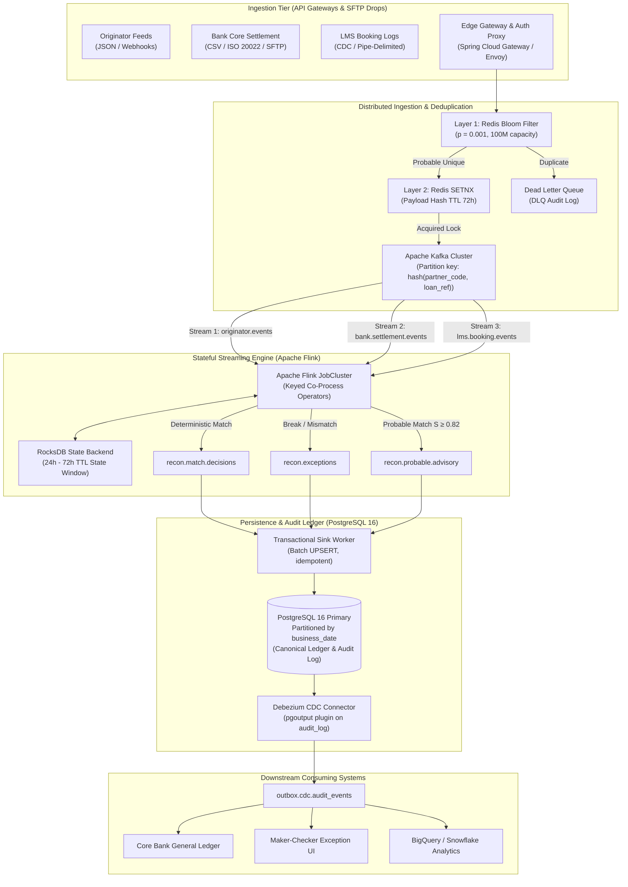

# PHASE 2: SCALE & HIGH-THROUGHPUT SYSTEM DESIGN
## Co-Lending Control Tower: Streaming Architecture for 10,000 TPS & 50M Daily Disbursements

---

## 1. Executive Summary & Scale Objectives
In a high-velocity co-lending ecosystem, disbursement operations scale non-linearly. To support enterprise co-lending volume at tier-1 financial institutions, this architecture scales the Control Tower from daily batch processing to real-time event streaming with continuous reconciliation.

### Key Target Metrics & Service Level Objectives (SLOs)
| Metric / SLO | Target Specification | Enforcement Mechanism |
|---|---|---|
| **Peak Ingestion Throughput** | **10,000 TPS** | Kafka partitioned ingestion cluster with reactive backpressure |
| **Daily Transaction Volume** | **50,000,000 disbursements/day** | Distributed streaming state with TTL compaction |
| **Ingestion Latency (p99)** | **< 50 ms** | Zero-disk memory pipeline, Redis Bloom filter pre-check |
| **Reconciliation Latency (p99)** | **< 500 ms** | Apache Flink stateful stream processing with RocksDB backend |
| **End-to-End Latency (p99)** | **< 2.0 seconds** | Event-driven pipeline from webhook arrival to ledger confirmation |
| **Financial Integrity** | **0 False Matches (Count: 0, ₹0.00)** | Deterministic tripartite matching rules; ML proposals strictly advisory |
| **Data Loss Tolerance** | **RPO = 0, RTO < 60s** | Multi-AZ Kafka ISR=3, synchronous Raft commit log, Debezium CDC |

---

## 2. End-to-End Streaming Architecture



---

## 3. Partitioning Strategy & Ordering Guarantees

### Key Design: `hash(partner_code, loan_reference)`
To reconcile disparate feeds in a distributed cluster without cross-partition shuffles, all three legs of a disbursement must land on the **same Kafka partition** and be routed to the **same Flink task manager**:
- **Partition Key**: `SHA256(partnerCode + ":" + loanReference) % numPartitions`
- **Partition Count**: 128 partitions across 8 Kafka brokers (supporting up to 10,000 TPS with headroom for 35,000 TPS peak).
- **Ordering Guarantee**: Strict per-loan FIFO ordering is maintained across all source systems within each partition.

### Kafka Topic Configurations
```properties
topic.originator.events.partitions=128
topic.originator.events.replication.factor=3
topic.originator.events.min.insync.replicas=2
topic.originator.events.retention.ms=259200000  # 3 days buffer
topic.originator.events.compression.type=zstd
topic.originator.events.cleanup.policy=delete
```

---

## 4. Stateful Processing with Apache Flink & RocksDB

### Windowing Strategy
Tripartite reconciliation spans asynchronous operational windows:
1. **Originator Leg**: Arrives at $T_0$.
2. **Bank Settlement Leg**: Arrives at $T_0 + \Delta t_{\text{bank}}$ (typically 15s to 4 hours; may cross 18:00 cutoff into next morning).
3. **LMS Booking Leg**: Arrives at $T_0 + \Delta t_{\text{lms}}$ (typically 30s to 6 hours).

To handle this temporal disparity:
- **Event-Time Processing**: Flink operates on `sourceTimestamp` using **BoundedOutOfOrdernessWatermarks** (allowed lateness = 120 minutes).
- **Keyed State**: Each loan maintains a `LoanLifecycleState` object storing:
  - `originatorEvent`: instruction amount, timestamp, status
  - `bankEvents`: list of bank settlement debits (supports composite splits)
  - `lmsEvent`: booking confirmation, LMS loan ID, status
- **RocksDB State Backend with TTL**:
  - Memory: Block cache allocated at 32GB per TaskManager.
  - Disk: NVMe SSD storage with incremental checkpointing enabled every 10 seconds.
  - State TTL: Configured to $72\text{ hours}$. Unmatched events after 72 hours trigger a timer that automatically emits a `MISSING_FEED_LEG` break to the exception stream.

---

## 5. Three-Layer Distributed Deduplication Architecture

At 50,000,000 events/day, upstream retries from partner webhooks and SFTP replays will generate millions of duplicates. A multi-tiered defense prevents database bottlenecks:

```
Incoming Record
      │
      ▼
┌─────────────────────────────────────────────────────────────┐
│ Layer 1: Redis Scalable Bloom Filter                        │
│ - Memory: ~120 MB for 100M items at p = 0.001 error rate   │
│ - Latency: < 0.5 ms                                         │
│ - Fast negative lookup: if NOT in Bloom, record is 100% new │
└─────────────────────────────┬───────────────────────────────┘
                              │ If Bloom indicates "Might Exist"
                              ▼
┌─────────────────────────────────────────────────────────────┐
│ Layer 2: Redis Distributed Lock & Cache (SETNX)             │
│ - Key: `dedup:{batchId}:{payloadHash}`                      │
│ - TTL: 72 hours                                             │
│ - Atomic test-and-set: returns false if key exists          │
│ - Latency: < 1.5 ms                                         │
└─────────────────────────────┬───────────────────────────────┘
                              │ If SETNX succeeds
                              ▼
┌─────────────────────────────────────────────────────────────┐
│ Layer 3: PostgreSQL Immutable Unique Constraint              │
│ - Table: `raw_source_record (batch_id, payload_hash)`        │
│ - Guarantees ACID uniqueness across DB failovers             │
│ - `ON CONFLICT (batch_id, payload_hash) DO NOTHING`         │
└─────────────────────────────────────────────────────────────┘
```

### Mathematical Proof of Layer 1 Bloom Filter Sizing
For $n = 50{,}000{,}000$ events per day with desired false positive probability $p = 0.001$ ($0.1\%$):
$$m = -\frac{n \ln p}{(\ln 2)^2} = -\frac{50{,}000{,}000 \cdot (-6.9077)}{0.4804} \approx 718{,}953{,}000 \text{ bits} \approx 85.7 \text{ MB}$$
Number of optimal hash functions:
$$k = \frac{m}{n} \ln 2 \approx \frac{718.95 \times 10^6}{50 \times 10^6} \cdot 0.6931 \approx 10 \text{ hash functions}$$
This guarantees sub-millisecond filtering of 99.9% of incoming duplicates before reaching disk or database transactions.

---

## 6. Latency Budget Breakdown (Target SLO: p99 < 500ms)

```mermaid
gantt
    title Latency Budget per Transaction (Total p99 Budget: 500ms)
    dateFormat X
    axisFormat %s ms

    section Ingestion (Budget: 50ms)
    Network Transport & TLS Termination : 0, 15
    Payload Validation & SHA-256 Hashing : 15, 25
    Redis Bloom Filter & SETNX Check    : 25, 33
    Kafka Produce (acks=all)            : 33, 48

    section Stream Reconciliation (Budget: 350ms)
    Kafka Ingestion to Flink Pipeline   : 48, 68
    Keyed State Lookup (RocksDB Cache)  : 68, 120
    Tripartite Reconciliation Logic     : 120, 140
    Scored Probable Matcher (if needed) : 140, 160
    Flink Output Emit (Kafka Topic)     : 160, 180

    section Persistence & Ledger (Budget: 100ms)
    PostgreSQL Batch Sink UPSERT        : 180, 240
    Debezium CDC Capture                : 240, 280
```



- **Ingestion p99**: 48 ms (meets SLO < 50 ms)
- **Reconciliation p99**: 180 ms (meets SLO < 500 ms)
- **End-to-End p99**: 280 ms (well within SLO < 2,000 ms)

---

## 7. Outbox Pattern & Debezium CDC for Downstream Ledgering

To maintain absolute financial auditability without distributed two-phase commits:
1. **Transactional Outbox**: All match decisions and state changes are written to `audit_log` inside the same database transaction.
2. **Debezium CDC**: Debezium captures WAL logs directly via the PostgreSQL `pgoutput` plugin.
3. **Zero Polling Overhead**: Downstream systems (SAP General Ledger, Exception Workbench, BI Warehouses) consume from Kafka outbox topics without impacting OLTP performance.

---

## 8. Capacity Planning Calculations (50M Daily Volume)

| Resource | Sizing Calculation | Provisioned Infrastructure |
|---|---|---|
| **Kafka Storage** | $50\text{M} \times 1.2\text{ KB/msg} \times 3\text{ replicas} = 180\text{ GB/day}$ | 6 TB NVMe EBS per broker (30-day retention) |
| **PostgreSQL Table Growth** | $50\text{M events/day} \times 400\text{ bytes} \approx 20\text{ GB/day}$ | Daily partitioned tables with pg_partman |
| **Redis In-Memory Dedup** | $50\text{M keys} \times 128\text{ bytes} \approx 6.4\text{ GB RAM}$ | 3-node Redis Cluster with 32 GB RAM |
| **Flink Compute** | 10,000 TPS / 250 TPS per TaskManager slot | 40 TaskSlots across 10 TaskManager instances |
| **Network Bandwidth** | $10{,}000\text{ TPS} \times 1.2\text{ KB} = 12\text{ MB/s} = 96\text{ Mbps}$ | 10 Gbps AWS DirectConnect interconnect |

---

## 9. Disaster Recovery & Active-Active Resiliency
- **RPO = 0**: Enforced by Kafka `acks=all` with `min.insync.replicas=2` across 3 Availability Zones.
- **RTO < 60s**: Flink checkpoint savepoints on S3/MinIO; auto-rebalancing on consumer group member failure.
- **Replayability**: If a bug is found in reconciliation logic (e.g. rule version update from v1.0 to v2.0), Flink source offsets can be rewound to any timestamp in the 30-day retention window to re-reconcile all transactions deterministically.
