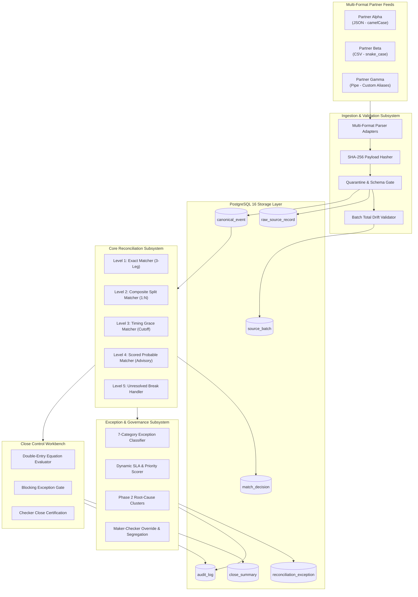
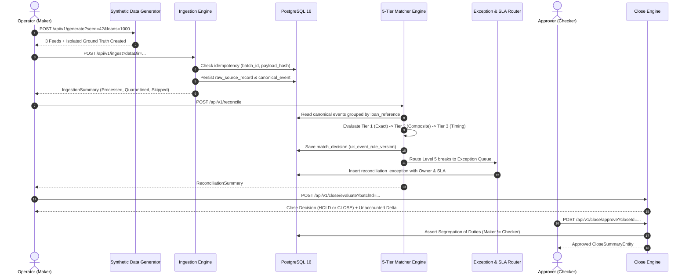
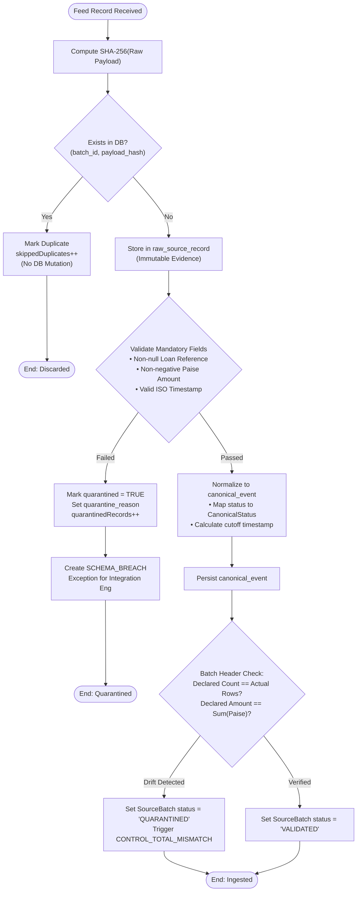
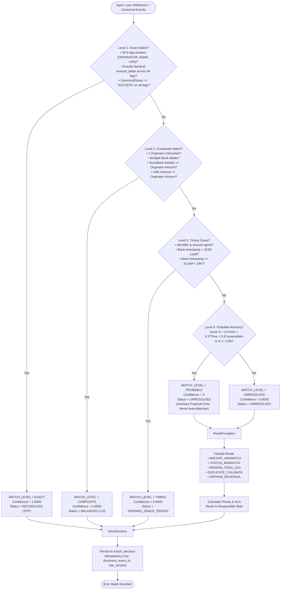
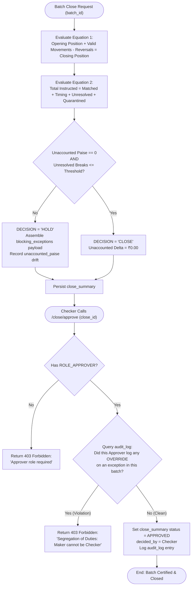

# Vivriti Co-Lending Control Tower: System Design, Architecture, Data Dictionary & API Specification

---

## 1. Executive Summary & Business Context

### 1.1 The Co-Lending Problem Space
Under Reserve Bank of India (RBI) co-lending directives (CLM/PRI-Lending), loans are jointly disbursed by a primary lending institution (**NBFC / Originator**) and a funding institution (**Bank**). A single disbursement lifecycle does **not** reside within a single ledger; it spans **three completely separate corporate entities with independent architectures, network clocks, and reporting schedules**:

1. **Originator (NBFC)**: Interacts with the borrower, captures KYC, issues the disbursement instruction, and specifies the initial loan parameters.
2. **Settlement Bank Gateway**: Holds the dedicated escrow account, receives disbursement instructions, executes NEFT/RTGS/IMPS fund transfers, and emits banking confirmation callbacks with a Unique Transaction Reference (UTR).
3. **Loan Management System (LMS - Vivriti Core)**: Manages loan servicing, generates repayment amortization schedules, and charges accrued interest.

```
       [ NBFC / Originator ]           [ Escrow Bank Gateway ]           [ Vivriti Core LMS ]
     (Disbursement Instruction)        (Settlement Fund Transfer)        (Booking & Repayment)
                 │                                 │                               │
                 │ Format: JSON / CSV / Pipe       │ Format: Banking MT940 / CSV   │ Format: Core Ledger API
                 ▼                                 ▼                               ▼
       ┌──────────────────────────────────────────────────────────────────────────────────┐
       │                          CO-LENDING CONTROL TOWER                                │
       │  • Cryptographic SHA-256 Provenance       • 5-Tier Deterministic Engine          │
       │  • Zero-Tolerance Control Equations       • Maker-Checker Segregation of Duties  │
       └──────────────────────────────────────────────────────────────────────────────────┘
```

### 1.2 Core Financial Invariants (Non-Negotiable)
1. **Indian Currency Integer Invariant**: All monetary values are represented and stored as 64-bit signed integers (`BIGINT`) representing **Indian Paise** ($\text{₹}1.00 = 100 \text{ paise}$). Floating-point types (`FLOAT`, `DOUBLE`) are strictly forbidden across storage, serialization, and calculations to prevent IEEE 754 precision loss.
2. **Zero-Tolerance Financial Control**: 
   $$\text{Total Instructed Paise} = \text{Matched} + \text{Timing Pending} + \text{Unresolved Exceptions} + \text{Quarantined}$$
   $$\text{Unaccounted Delta} \equiv 0 \text{ Paise}$$
   If even $1 \text{ paise}$ is unaccounted for, the batch automatically flips to **`HOLD`** and blocks close. Silent write-offs or artificial balancing entries are blocked by design.
3. **Non-Negotiable Gate Metric**:
   $$\text{False Matches} \equiv 0 \quad \text{and} \quad \text{False Match Exposure} \equiv \text{₹}0.00$$
   Probable / heuristic matches are strictly **read-only advisory** and **never auto-reconcile**.

---

## 2. System Architecture & Topology

### 2.1 Component Architecture Diagram



---

### 2.2 Phase 2 High-Scale Streaming Topology (10,000 TPS / 50M Daily)

To scale from batch file ingestion to high-frequency streaming at **10,000 TPS**, the architecture transitions to an event-driven stream processing topology:

```mermaid
flowchart LR
    subgraph Sources ["Upstream Producers"]
        P1["Originator Webhooks"]
        P2["Bank ISO 20022 Feeds"]
        P3["LMS Event Bus"]
    end

    subgraph Kafka ["Distributed Ingestion Bus (Apache Kafka)"]
        K1["Topic: events.originator<br/>Key: hash(partner, loan_ref)"]
        K2["Topic: events.bank<br/>Key: hash(partner, loan_ref)"]
        K3["Topic: events.lms<br/>Key: hash(partner, loan_ref)"]
    end

    subgraph Deduplication ["Distributed Cache"]
        R_BF["Redis Bloom Filter<br/>(99.99% Duplicate Early Reject)"]
        R_SET["Redis SETNX<br/>(24h Distributed Lease)"]
    end

    subgraph Flink ["Stateful Stream Engine (Apache Flink)"]
        FL1["24h RocksDB State Window"]
        FL2["Watermark Cutoff Evaluator"]
        FL3["5-Tier Deterministic Matcher"]
    end

    subgraph Persistence ["Storage & CDC Replay"]
        PG[("PostgreSQL Aurora Clustered")]
        CDC["Debezium CDC (audit_log Outbox)"]
        Downstream["Downstream Analytics / General Ledger"]
    end

    Sources --> Kafka
    Kafka --> Deduplication
    Deduplication --> Flink
    Flink --> PG
    PG --> CDC --> Downstream
```



---

## 3. End-to-End Operational Flowcharts

### 3.1 Master Execution Pipeline Flowchart



---

### 3.2 Ingestion & Quarantine State Machine Flowchart



---

### 3.3 5-Tier Reconciliation Matcher Decision Flowchart



---

### 3.4 Batch Close Equation & Maker-Checker Flowchart



---

## 4. Comprehensive Data Dictionary

Every attribute across all 7 database tables is detailed below with exact data types, constraints, and business domain rules.

### 4.1 Table: `source_batch`
Tracks each ingested physical file or transmission batch.
- **Primary Key**: `batch_id`
- **Unique Constraints**: None

| Field Name | Data Type | Nullable | Constraints / Defaults | Description / Domain Purpose |
| :--- | :--- | :--- | :--- | :--- |
| `batch_id` | `VARCHAR(64)` | `NOT NULL` | **Primary Key** | Unique composite identifier (e.g., `B-PARTNER_ALPHA-ORIGINATOR-20240115`). |
| `source_system` | `VARCHAR(32)` | `NOT NULL` | `CHECK IN ('ORIGINATOR', 'BANK', 'LMS')` | Source leg delivering this feed. |
| `partner_code` | `VARCHAR(32)` | `NOT NULL` | — | Identifying partner code (`PARTNER_ALPHA`, `PARTNER_BETA`, `PARTNER_GAMMA`). |
| `business_date` | `DATE` | `NOT NULL` | — | Financial accounting business date (e.g., `2024-01-15`). |
| `declared_count` | `INT` | `NOT NULL` | — | Total row count declared in batch header/envelope. |
| `declared_amount_paise` | `BIGINT` | `NOT NULL` | — | Total disbursement value declared in batch header (in Indian Paise). |
| `status` | `VARCHAR(32)` | `NOT NULL` | `DEFAULT 'RECEIVED'`<br/>`CHECK IN ('RECEIVED', 'VALIDATED', 'QUARANTINED', 'PROCESSED')` | Current lifecycle state of the batch. |
| `received_at` | `TIMESTAMPTZ` | `NULL` | `DEFAULT CURRENT_TIMESTAMP` | System ingestion timestamp with UTC timezone offset. |

---

### 4.2 Table: `raw_source_record`
Stores immutable raw payloads for tamper-proof auditability and deduplication.
- **Primary Key**: `record_id`
- **Foreign Keys**: `batch_id REFERENCES source_batch(batch_id)`
- **Unique Constraints**: `uk_batch_payload_hash (batch_id, payload_hash)`

| Field Name | Data Type | Nullable | Constraints / Defaults | Description / Domain Purpose |
| :--- | :--- | :--- | :--- | :--- |
| `record_id` | `VARCHAR(64)` | `NOT NULL` | **Primary Key** | Deterministic record ID (`{batchId}-R{index}`). |
| `batch_id` | `VARCHAR(64)` | `NOT NULL` | **Foreign Key** $\to$ `source_batch.batch_id` | Parent transmission batch. |
| `source_system` | `VARCHAR(32)` | `NOT NULL` | — | Source system origin (`ORIGINATOR`, `BANK`, `LMS`). |
| `payload_hash` | `VARCHAR(64)` | `NOT NULL` | SHA-256 hex string | 64-character SHA-256 digest of untouched raw payload. |
| `raw_payload` | `TEXT` | `NOT NULL` | — | Original string payload (raw JSON, CSV row, or pipe string). |
| `quarantined` | `BOOLEAN` | `NULL` | `DEFAULT FALSE` | True if record failed schema or integrity validation. |
| `quarantine_reason` | `TEXT` | `NULL` | — | Human-readable explanation of why quarantine occurred. |
| `received_at` | `TIMESTAMPTZ` | `NULL` | `DEFAULT CURRENT_TIMESTAMP` | Timestamp when raw record was received. |

---

### 4.3 Table: `canonical_event`
The normalized, structured representation of every financial movement across systems.
- **Primary Key**: `event_id`
- **Foreign Keys**: `raw_record_id REFERENCES raw_source_record(record_id)`

| Field Name | Data Type | Nullable | Constraints / Defaults | Description / Domain Purpose |
| :--- | :--- | :--- | :--- | :--- |
| `event_id` | `VARCHAR(64)` | `NOT NULL` | **Primary Key** | Unique UUID v4 for the canonical event. |
| `raw_record_id` | `VARCHAR(64)` | `NOT NULL` | **Foreign Key** $\to$ `raw_source_record.record_id` | Pointer to raw source payload for audit lineage. |
| `business_event_id` | `VARCHAR(64)` | `NOT NULL` | — | Stable transaction ID across systems (`EVT-LOAN-000001`). |
| `correlation_id` | `VARCHAR(64)` | `NOT NULL` | — | End-to-end distributed tracing ID (`CORR-LOAN-000001`). |
| `loan_reference` | `VARCHAR(64)` | `NOT NULL` | — | Borrower loan reference number (`LOAN-000001`). |
| `partner_code` | `VARCHAR(32)` | `NOT NULL` | — | Partner code (`PARTNER_ALPHA`, etc.). |
| `source_system` | `VARCHAR(32)` | `NOT NULL` | — | System emitting this leg (`ORIGINATOR`, `BANK`, `LMS`). |
| `event_type` | `VARCHAR(32)` | `NOT NULL` | `CHECK IN ('DISBURSEMENT_INSTRUCTION', 'SETTLEMENT_DEBIT', 'LMS_BOOKING', 'REVERSAL')` | Functional event type classification. |
| `amount_paise` | `BIGINT` | `NOT NULL` | — | Monetary value in Indian Paise ($\text{₹}1 = 100\text{ paise}$). |
| `currency` | `VARCHAR(3)` | `NULL` | `DEFAULT 'INR'` | ISO 4217 currency code. |
| `source_status` | `VARCHAR(32)` | `NOT NULL` | — | Raw status string reported by source feed. |
| `canonical_status` | `VARCHAR(32)` | `NOT NULL` | `CHECK IN ('SUCCESS', 'FAILED', 'PENDING', 'REVERSED')` | Normalized financial status. |
| `reversal_reference`| `VARCHAR(64)` | `NULL` | — | Parent loan reference if this event is a reversal. |
| `source_timestamp` | `TIMESTAMPTZ` | `NOT NULL` | — | Timestamp of occurrence reported by source. |
| `received_timestamp`| `TIMESTAMPTZ` | `NOT NULL` | — | Timestamp when received by Control Tower. |
| `cutoff_timestamp` | `TIMESTAMPTZ` | `NOT NULL` | — | Daily reconciliation cutoff threshold (18:00 UTC). |

---

### 4.4 Table: `match_decision`
Stores the output of the 5-Tier Reconciliation Engine.
- **Primary Key**: `decision_id`
- **Unique Constraints**: `uk_event_rule_version (business_event_id, rule_version)`

| Field Name | Data Type | Nullable | Constraints / Defaults | Description / Domain Purpose |
| :--- | :--- | :--- | :--- | :--- |
| `decision_id` | `VARCHAR(64)` | `NOT NULL` | **Primary Key** | UUID v4 for the match decision. |
| `business_event_id` | `VARCHAR(64)` | `NOT NULL` | — | Business event reconciled (`EVT-LOAN-000001`). |
| `rule_version` | `VARCHAR(16)` | `NOT NULL` | — | Version tag of reconciliation ruleset (`v1.0`). |
| `match_level` | `VARCHAR(32)` | `NOT NULL` | `CHECK IN ('EXACT', 'COMPOSITE', 'TIMING', 'PROBABLE', 'UNRESOLVED')` | Decided match tier. |
| `matched_event_ids` | `TEXT[]` | `NOT NULL` | Array of `event_id`s | Canonical event IDs that participated in this match. |
| `confidence_score` | `NUMERIC(5,4)`| `NULL` | Range: `0.0000` to `1.0000` | Match confidence score. |
| `evidence_payload` | `JSONB` | `NOT NULL` | — | Machine-readable evidence proof (amounts, diffs, splits). |
| `decided_at` | `TIMESTAMPTZ` | `NULL` | `DEFAULT CURRENT_TIMESTAMP` | Timestamp when decision was computed. |

---

### 4.5 Table: `reconciliation_exception`
Operational work queue tracking financial breaks, assignments, and SLAs.
- **Primary Key**: `exception_id`
- **Optimistic Locking**: `version`

| Field Name | Data Type | Nullable | Constraints / Defaults | Description / Domain Purpose |
| :--- | :--- | :--- | :--- | :--- |
| `exception_id` | `VARCHAR(64)` | `NOT NULL` | **Primary Key** | UUID v4 for the exception record. |
| `business_event_id` | `VARCHAR(64)` | `NOT NULL` | — | Identifier of broken transaction. |
| `classification` | `VARCHAR(64)` | `NOT NULL` | — | Break category (`AMOUNT_MISMATCH`, `STATUS_MISMATCH`, etc.). |
| `partner_code` | `VARCHAR(32)` | `NOT NULL` | — | Partner code responsible for the break. |
| `exposure_amount_paise`| `BIGINT` | `NOT NULL` | — | Value at risk in Indian Paise. |
| `owner_role` | `VARCHAR(64)` | `NOT NULL` | — | Assigned operational team role. |
| `recommended_action`| `TEXT` | `NOT NULL` | — | Standard Operating Procedure (SOP) remediation step. |
| `priority` | `VARCHAR(16)` | `NOT NULL` | `DEFAULT 'MEDIUM'`<br/>`CHECK IN ('CRITICAL', 'HIGH', 'MEDIUM', 'LOW')` | Dynamic operational priority score. |
| `sla_deadline` | `TIMESTAMPTZ` | `NOT NULL` | — | SLA breach timestamp countdown. |
| `status` | `VARCHAR(32)` | `NULL` | `DEFAULT 'OPEN'`<br/>`CHECK IN ('OPEN', 'IN_PROGRESS', 'RESOLVED', 'OVERRIDDEN')` | State of the break ticket. |
| `override_reason` | `TEXT` | `NULL` | — | Mandatory business justification if Maker overrode. |
| `actor_id` | `VARCHAR(64)` | `NULL` | — | User who overrode or modified the record. |
| `version` | `BIGINT` | `NULL` | `DEFAULT 0` | Optimistic concurrency control lock version. |
| `created_at` | `TIMESTAMPTZ` | `NULL` | `DEFAULT CURRENT_TIMESTAMP` | Exception creation timestamp. |

---

### 4.6 Table: `close_summary`
Captures the daily batch balance sheet verification and Maker-Checker approval.
- **Primary Key**: `close_id`
- **Foreign Keys**: `batch_id REFERENCES source_batch(batch_id)`

| Field Name | Data Type | Nullable | Constraints / Defaults | Description / Domain Purpose |
| :--- | :--- | :--- | :--- | :--- |
| `close_id` | `VARCHAR(64)` | `NOT NULL` | **Primary Key** | UUID v4 for the close record. |
| `batch_id` | `VARCHAR(64)` | `NOT NULL` | **Foreign Key** $\to$ `source_batch.batch_id` | Batch evaluated. |
| `business_date` | `DATE` | `NOT NULL` | — | Accounting business date. |
| `decision` | `VARCHAR(16)` | `NOT NULL` | `CHECK IN ('CLOSE', 'HOLD')` | Binary outcome of control equation. |
| `opening_position_paise` | `BIGINT` | `NOT NULL` | — | Balance at start of business day. |
| `valid_movements_paise` | `BIGINT` | `NOT NULL` | — | Sum of validated disbursements. |
| `reversals_paise` | `BIGINT` | `NOT NULL` | — | Sum of debit reversals. |
| `closing_position_paise` | `BIGINT` | `NOT NULL` | — | Final balance position. |
| `matched_paise` | `BIGINT` | `NOT NULL` | — | Successfully reconciled paise. |
| `timing_pending_paise` | `BIGINT` | `NOT NULL` | — | Legitimate timing lag within grace window. |
| `unresolved_exception_paise`| `BIGINT` | `NOT NULL` | — | Value of active breaks. |
| `quarantined_paise` | `BIGINT` | `NOT NULL` | — | Value in quarantine. |
| `unaccounted_paise` | `BIGINT` | `NOT NULL` | — | Discrepancy delta (MUST BE ZERO to CLOSE). |
| `blocking_exceptions` | `JSONB` | `NULL` | — | Array of break IDs that forced a HOLD. |
| `decided_by` | `VARCHAR(64)` | `NOT NULL` | — | User who evaluated or approved close. |
| `decided_at` | `TIMESTAMPTZ` | `NULL` | `DEFAULT CURRENT_TIMESTAMP` | Timestamp of close evaluation/certification. |

---

### 4.7 Table: `audit_log`
Append-only immutable ledger tracking every state transition and administrative action.
- **Primary Key**: `log_id`

| Field Name | Data Type | Nullable | Constraints / Defaults | Description / Domain Purpose |
| :--- | :--- | :--- | :--- | :--- |
| `log_id` | `VARCHAR(64)` | `NOT NULL` | **Primary Key** | UUID v4 for the audit entry. |
| `entity_name` | `VARCHAR(64)` | `NOT NULL` | — | Target entity (`ReconciliationException`, `CloseSummary`). |
| `entity_id` | `VARCHAR(64)` | `NOT NULL` | — | Target primary key. |
| `action` | `VARCHAR(32)` | `NOT NULL` | — | Action verb (`OVERRIDE`, `APPROVE`, `UPDATE_STATUS`). |
| `actor_id` | `VARCHAR(64)` | `NOT NULL` | — | Authenticated username who performed action. |
| `before_state` | `JSONB` | `NULL` | — | Snapshot before mutation. |
| `after_state` | `JSONB` | `NULL` | — | Snapshot after mutation. |
| `reason` | `TEXT` | `NULL` | — | Mandatory business rationale. |
| `rule_version` | `VARCHAR(16)` | `NOT NULL` | — | Ruleset version active at execution. |
| `created_at` | `TIMESTAMPTZ` | `NULL` | `DEFAULT CURRENT_TIMESTAMP` | Immutable timestamp. |

---

## 5. Entity-Relationship (ER) Diagram

```mermaid
erDiagram
    SOURCE_BATCH ||--o{ RAW_SOURCE_RECORD : "contains (1:N)"
    SOURCE_BATCH ||--o{ CLOSE_SUMMARY : "evaluated in (1:N)"
    RAW_SOURCE_RECORD ||--o| CANONICAL_EVENT : "normalizes to (1:1)"
    
    CANONICAL_EVENT }o--o| MATCH_DECISION : "participates in"
    MATCH_DECISION ||--o| RECONCILIATION_EXCEPTION : "triggers break (0:1)"
    
    RECONCILIATION_EXCEPTION ||--o{ AUDIT_LOG : "audited by (1:N)"
    CLOSE_SUMMARY ||--o{ AUDIT_LOG : "governed by (1:N)"

    SOURCE_BATCH {
        varchar(64) batch_id PK
        varchar(32) source_system
        varchar(32) partner_code
        date business_date
        int declared_count
        bigint declared_amount_paise
        varchar(32) status
        timestamptz received_at
    }

    RAW_SOURCE_RECORD {
        varchar(64) record_id PK
        varchar(64) batch_id FK
        varchar(32) source_system
        varchar(64) payload_hash
        text raw_payload
        boolean quarantined
        text quarantine_reason
        timestamptz received_at
    }

    CANONICAL_EVENT {
        varchar(64) event_id PK
        varchar(64) raw_record_id FK
        varchar(64) business_event_id
        varchar(64) correlation_id
        varchar(64) loan_reference
        varchar(32) partner_code
        varchar(32) source_system
        varchar(32) event_type
        bigint amount_paise
        varchar(3) currency
        varchar(32) source_status
        varchar(32) canonical_status
        varchar(64) reversal_reference
        timestamptz source_timestamp
        timestamptz received_timestamp
        timestamptz cutoff_timestamp
    }

    MATCH_DECISION {
        varchar(64) decision_id PK
        varchar(64) business_event_id
        varchar(16) rule_version
        varchar(32) match_level
        text_array matched_event_ids
        numeric(5,4) confidence_score
        jsonb evidence_payload
        timestamptz decided_at
    }

    RECONCILIATION_EXCEPTION {
        varchar(64) exception_id PK
        varchar(64) business_event_id
        varchar(64) classification
        varchar(32) partner_code
        bigint exposure_amount_paise
        varchar(64) owner_role
        text recommended_action
        varchar(16) priority
        timestamptz sla_deadline
        varchar(32) status
        text override_reason
        varchar(64) actor_id
        bigint version
        timestamptz created_at
    }

    CLOSE_SUMMARY {
        varchar(64) close_id PK
        varchar(64) batch_id FK
        date business_date
        varchar(16) decision
        bigint opening_position_paise
        bigint valid_movements_paise
        bigint reversals_paise
        bigint closing_position_paise
        bigint matched_paise
        bigint timing_pending_paise
        bigint unresolved_exception_paise
        bigint quarantined_paise
        bigint unaccounted_paise
        jsonb blocking_exceptions
        varchar(64) decided_by
        timestamptz decided_at
    }

    AUDIT_LOG {
        varchar(64) log_id PK
        varchar(64) entity_name
        varchar(64) entity_id
        varchar(32) action
        varchar(64) actor_id
        jsonb before_state
        jsonb after_state
        text reason
        varchar(16) rule_version
        timestamptz created_at
    }
```

---

## 6. Complete REST API Specification

### Base URL & Global Headers
- **Base URL**: `http://localhost:8080/api/v1`
- **Security**: HTTP Basic Authentication
  - `operator:operator123` (`ROLE_OPERATOR` - Maker)
  - `approver:approver123` (`ROLE_APPROVER` - Checker)
- **Tracing Header**: `X-Correlation-Id: <UUID>` (returned on all responses)

---

### 6.1 Generator Controller

#### `POST /api/v1/generate`
Generates deterministic synthetic partner feeds across 3 business days and 10 anomaly classes.

- **Query Parameters**:
  - `seed` (int64, optional, default: `42`): Seed for deterministic random generation.
  - `loans` (int32, optional, default: `1000`): Unique disbursement instructions count.
  - `outputDir` (string, optional, default: `./data/generated`): Output directory path.
- **Responses**:
  - `200 OK`:
    ```json
    {
      "status": "GENERATED",
      "seed": 42,
      "loanCount": 1000,
      "outputDir": "./data/seed_demo",
      "message": "Feeds and ground truth generated successfully"
    }
    ```
- **Example cURL**:
  ```bash
  curl -s -u operator:operator123 -X POST "http://localhost:8080/api/v1/generate?seed=42&loans=1000&outputDir=./data/seed_demo"
  ```

---

#### `POST /api/v1/reset`
Performs a clean-slate database reset by truncating all 7 transactional tables.

- **Responses**:
  - `200 OK`:
    ```json
    {
      "status": "RESET",
      "message": "All transactional tables cleared successfully"
    }
    ```
- **Example cURL**:
  ```bash
  curl -s -u operator:operator123 -X POST http://localhost:8080/api/v1/reset
  ```

---

### 6.2 Ingestion Controller

#### `POST /api/v1/ingest`
Scans a target data directory, parses multi-format feeds (JSON, CSV, Pipe), computes SHA-256 hashes, quarantines malformed inputs, and persists canonical events.

- **Query Parameters**:
  - `dataDir` (string, optional, default: `./data/generated`): Directory containing partner files.
- **Responses**:
  - `200 OK`:
    ```json
    {
      "totalRecords": 2986,
      "processedRecords": 2986,
      "quarantinedRecords": 0,
      "skippedDuplicates": 0,
      "batchStatus": "COMPLETED"
    }
    ```
- **Example cURL**:
  ```bash
  curl -s -u operator:operator123 -X POST "http://localhost:8080/api/v1/ingest?dataDir=./data/seed_demo"
  ```

---

### 6.3 Reconciliation Controller

#### `POST /api/v1/reconcile`
Executes the thread-safe 5-tier deterministic reconciliation engine across all ingested canonical events.

- **Responses**:
  - `200 OK`:
    ```json
    {
      "totalLoans": 731,
      "exactMatches": 680,
      "compositeMatches": 6,
      "timingMatches": 0,
      "probableMatches": 41,
      "unresolvedBreaks": 4,
      "totalMatchedPaise": 340675973,
      "totalUnresolvedPaise": 22298935
    }
    ```
- **Example cURL**:
  ```bash
  curl -s -u operator:operator123 -X POST http://localhost:8080/api/v1/reconcile
  ```

---

#### `GET /api/v1/match-decisions`
Retrieves all match decisions, with optional filtering by match level.

- **Query Parameters**:
  - `matchLevel` (string, optional): Filter by `EXACT`, `COMPOSITE`, `TIMING`, `PROBABLE`, or `UNRESOLVED`.
- **Responses**:
  - `200 OK`: Array of `MatchDecisionEntity` objects.

---

### 6.4 Evaluator Controller

#### `GET /api/v1/evaluate`
Post-hoc evaluator comparing reconciliation decisions against isolated ground truth to generate the Hard Gate scorecard.

- **Query Parameters**:
  - `groundTruthPath` (string, required): File path to `ground_truth.json`.
- **Responses**:
  - `200 OK`:
    ```json
    {
      "phase1Gate": {
        "gateStatus": "PASSED",
        "falseMatchCount": 0,
        "falseMatchExposureValue": "₹0.00",
        "straightThroughRate": "93.02%",
        "controlTotalDelta": "₹0.00",
        "unresolvedBreaks": 4
      },
      "phase2Intelligence": {
        "probableProposalsCount": 41,
        "confusionMatrix": {
          "AMOUNT_MISMATCH": { "PROBABLE": 14, "UNRESOLVED": 0 },
          "STATUS_MISMATCH": { "PROBABLE": 12, "UNRESOLVED": 0 },
          "ORPHAN_REVERSAL": { "UNRESOLVED": 4 }
        }
      }
    }
    ```
- **Example cURL**:
  ```bash
  curl -s -u operator:operator123 "http://localhost:8080/api/v1/evaluate?groundTruthPath=./data/seed_demo/groundtruth/ground_truth.json"
  ```

---

### 6.5 Exception Controller

#### `GET /api/v1/exceptions`
Returns active exception inventory, with optional filters.

- **Query Parameters**:
  - `status` (string, optional): `OPEN`, `IN_PROGRESS`, `RESOLVED`, `OVERRIDDEN`.
  - `priority` (string, optional): `CRITICAL`, `HIGH`, `MEDIUM`, `LOW`.
  - `partnerCode` (string, optional): e.g. `PARTNER_ALPHA`.
- **Example cURL**:
  ```bash
  curl -s -u operator:operator123 http://localhost:8080/api/v1/exceptions
  ```

---

#### `POST /api/v1/exceptions/{exceptionId}/override`
Allows an authorized Maker to override an exception with a mandatory business justification reason.

- **Path Parameters**:
  - `exceptionId` (string, required): Exception UUID.
- **Query Parameters or JSON Body**:
  - `reason` (string, required): Business justification.
- **Responses**:
  - `200 OK`: Updated `ReconciliationExceptionEntity` with status `OVERRIDDEN`.
  - `400 Bad Request`: If reason is blank or missing.
- **Example cURL**:
  ```bash
  curl -s -u operator:operator123 -X POST "http://localhost:8080/api/v1/exceptions/e3b0c442-98fc-4211-8e01-000000000001/override?reason=Approved+by+Partner+Credit+Committee"
  ```

---

#### `GET /api/v1/exceptions/clusters`
Returns Phase 2 root-cause intelligence clusters grouped by partner and failure pattern.

- **Responses**:
  - `200 OK`:
    ```json
    [
      {
        "clusterKey": "PARTNER_GAMMA::AMOUNT_MISMATCH",
        "partnerCode": "PARTNER_GAMMA",
        "classification": "AMOUNT_MISMATCH",
        "exceptionCount": 435,
        "totalExposureInr": "₹2,212,822.89",
        "rootCauseHypothesis": "Fee deduction drift on PARTNER_GAMMA feed...",
        "recommendedRemediation": "Verify partner fee schedule configuration...",
        "assignedOwnerRole": "FINANCE_OPERATIONS"
      }
    ]
    ```

---

### 6.6 Close Control Controller

#### `GET /api/v1/close/batches`
Returns all ingested source batches.

- **Example cURL**:
  ```bash
  curl -s -u operator:operator123 http://localhost:8080/api/v1/close/batches
  ```

---

#### `POST /api/v1/close/evaluate`
Runs the double-entry control equations on a selected batch.

- **Query Parameters**:
  - `batchId` (string, required): Target batch ID.
- **Responses**:
  - `200 OK`:
    ```json
    {
      "closeId": "7c9e6679-7425-40de-944b-e07fc1f90ae7",
      "batchId": "B-PARTNER_ALPHA-ORIGINATOR-20240115",
      "decision": "CLOSE",
      "openingPositionPaise": 0,
      "validMovementsPaise": 5128704619,
      "reversalsPaise": 0,
      "closingPositionPaise": 5128704619,
      "matchedPaise": 5128704619,
      "unaccountedPaise": 0,
      "decidedBy": "operator"
    }
    ```
- **Example cURL**:
  ```bash
  curl -s -u operator:operator123 -X POST "http://localhost:8080/api/v1/close/evaluate?batchId=B-PARTNER_ALPHA-ORIGINATOR-20240115"
  ```

---

#### `POST /api/v1/close/approve`
Approves a `CLOSE` decision. Enforces Maker-Checker segregation of duties.

- **Query Parameters**:
  - `closeId` (string, required): Close UUID.
- **Responses**:
  - `200 OK`: Batch certified and closed by Checker.
  - `403 Forbidden`: If user lacks `ROLE_APPROVER` or if Maker == Checker.
    ```json
    {
      "error": "SEGREGATION_VIOLATION",
      "message": "Segregation of duties violation: Maker cannot be Checker"
    }
    ```
- **Example cURL (as Approver)**:
  ```bash
  curl -s -u approver:approver123 -X POST "http://localhost:8080/api/v1/close/approve?closeId=7c9e6679-7425-40de-944b-e07fc1f90ae7"
  ```

---

### 6.7 Audit & Lineage Controller

#### `GET /api/v1/audit/trace/{loanReference}`
Inspects the cryptographic evidence chain from raw bytes to final match decision.

- **Path Parameters**:
  - `loanReference` (string, required): e.g. `LOAN-000001`.
- **Responses**:
  - `200 OK`:
    ```json
    {
      "loanReference": "LOAN-000001",
      "totalEvents": 3,
      "canonicalEvents": [
        {
          "sourceSystem": "BANK",
          "eventType": "SETTLEMENT_DEBIT",
          "amountInr": "₹3,112.48",
          "payloadHash": "15830df7faa1ae979594ecf673b80d7fbc7db05486a6fea78e2db2e4aade8d9c",
          "rawPayload": "LOAN-000001|311248|2024-01-15T09:55Z|SUCCESS|UTR-LOAN-000001-918|SETTLEMENT_DEBIT|CORR-LOAN-000001|EVT-LOAN-000001"
        }
      ],
      "matchDecisions": [
        {
          "matchLevel": "EXACT",
          "confidenceScore": 1.0000,
          "ruleVersion": "v1.0"
        }
      ]
    }
    ```
- **Example cURL**:
  ```bash
  curl -s -u operator:operator123 http://localhost:8080/api/v1/audit/trace/LOAN-000001
  ```

---

## 7. Security & Governance Matrix

| Action | Allowed Role | Authentication | Audit Logged? | Enforcement Mechanism |
| :--- | :--- | :--- | :--- | :--- |
| **Run Generation** | `ROLE_OPERATOR` | Basic Auth | No | REST API Gateway |
| **Ingest Feeds** | `ROLE_OPERATOR` | Basic Auth | Yes (`source_batch`) | Hasher & Quarantine Engine |
| **Execute Reconciliation**| `ROLE_OPERATOR` | Basic Auth | Yes (`match_decision`) | `synchronized` Service Lock |
| **Override Exception** | `ROLE_OPERATOR` | Basic Auth | Yes (`audit_log`) | Optimistic Lock (`@Version`) + Mandatory Reason |
| **Evaluate Batch Close** | `ROLE_OPERATOR`, `ROLE_APPROVER` | Basic Auth | Yes (`close_summary`)| Control Equation Engine |
| **Approve Batch Close** | `ROLE_APPROVER` **ONLY** | Basic Auth | Yes (`audit_log`) | Spring Security + `MakerCheckerGuard` |

